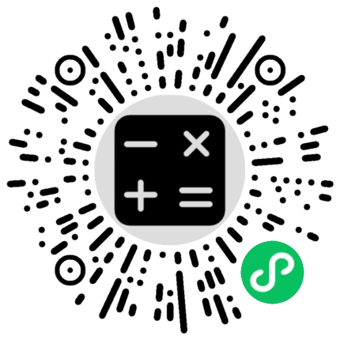

# TT Calculator App | TT 计算器应用

[English](#english) | [Chinese](#chinese)

<!-- 添加居中显示的二维码图片 -->

## 🧮 TT Calculator - Simple, Fast, and Free

TT Calculator is a completely free and ad-free simple calculator application with a clean, intuitive interface. It supports basic arithmetic operations such as addition, subtraction, multiplication, and division to meet your daily calculation needs.

### ✨ Key Features

- **Minimalist Interface Design**: Removes all unnecessary elements for a distraction-free experience
- **Fast Calculation**: Instant results with responsive operation
- **Calculation History**: Automatically saves your calculation history
- **Theme Options**: Light/Dark mode and additional minimal themes
- **Offline Usage**: Works completely offline with no user data collection
- **Sound Effects**: Optional sound feedback with multiple sound packs
- **Haptic Feedback**: Optional vibration feedback for button presses
- **Customization Options**:
  - Decimal places setting
  - Thousand separator toggle
  - Auto-copy result option
  - Multiple language support

### 🛠️ Technical Features

- Built with Vue.js and uni-app framework
- Responsive design for various screen sizes
- Efficient mathematical expression evaluation using mathjs
- Theme system with CSS variables
- Internationalization support
- Platform compatibility layer for cross-platform functionality

### 📱 Usage Scenarios

Perfect for:
- Student homework calculations
- Household budget calculations
- Work-related calculations
- Quick everyday math

Includes practical functions such as one-click clear, percentage calculation, and more. The app is lightweight, runs smoothly, and uses minimal system resources.

### 🙏 Special Thanks

This project was developed with the assistance of Cursor IDE, which significantly improved the development efficiency. Cursor's AI-powered features helped with:

- Code generation and completion
- Bug detection and fixing
- Refactoring suggestions
- Documentation generation
- Cross-platform compatibility solutions

---

## 🧮 TT 计算器 - 简洁、快速、免费

TT 计算器是一款完全免费且无广告的简易计算器，界面设计简洁明了，操作直观方便。支持加、减、乘、除等基础运算功能，满足日常计算需求。

### ✨ 主要特点

- **极简界面设计**：去除所有不必要元素，专注于计算体验
- **运算响应快速**：结果即时显示，操作流畅
- **计算历史记录**：自动保存计算历史，方便查看和重用
- **主题选择**：提供日间/夜间模式及其他极简主题
- **完全离线使用**：不需要网络连接，不收集用户数据
- **音效反馈**：可选的按键音效，提供多种音效包
- **触感反馈**：可选的按键振动反馈
- **自定义选项**：
  - 小数位数设置
  - 千位分隔符开关
  - 自动复制结果选项
  - 多语言支持

### 🛠️ 技术特点

- 使用 Vue.js 和 uni-app 框架构建
- 响应式设计，适配各种屏幕尺寸
- 使用 mathjs 高效计算数学表达式
- 基于 CSS 变量的主题系统
- 国际化支持
- 跨平台兼容性适配层

### 📱 适用场景

适用于：
- 学生作业计算
- 家庭记账计算
- 工作相关计算
- 日常快速计算

包含一键清除、百分比计算等实用功能。软件体积小巧，运行流畅，不占用过多系统资源。

### 🙏 特别鸣谢

本项目在开发过程中得到了 Cursor IDE 的强力支持，大幅提高了开发效率。Cursor 的 AI 驱动功能帮助实现了：

- 代码生成与补全
- 错误检测与修复
- 重构建议
- 文档生成
- 跨平台兼容性解决方案
